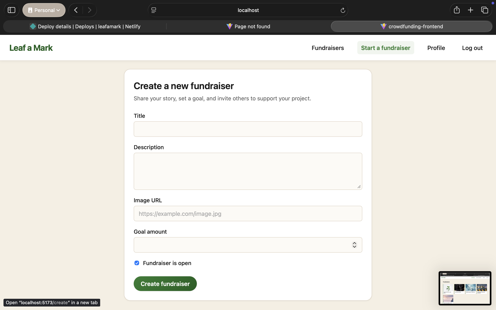
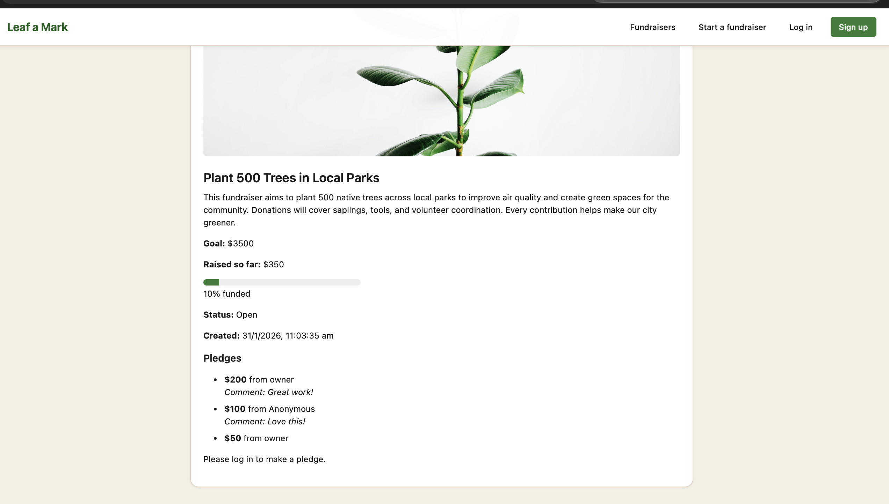
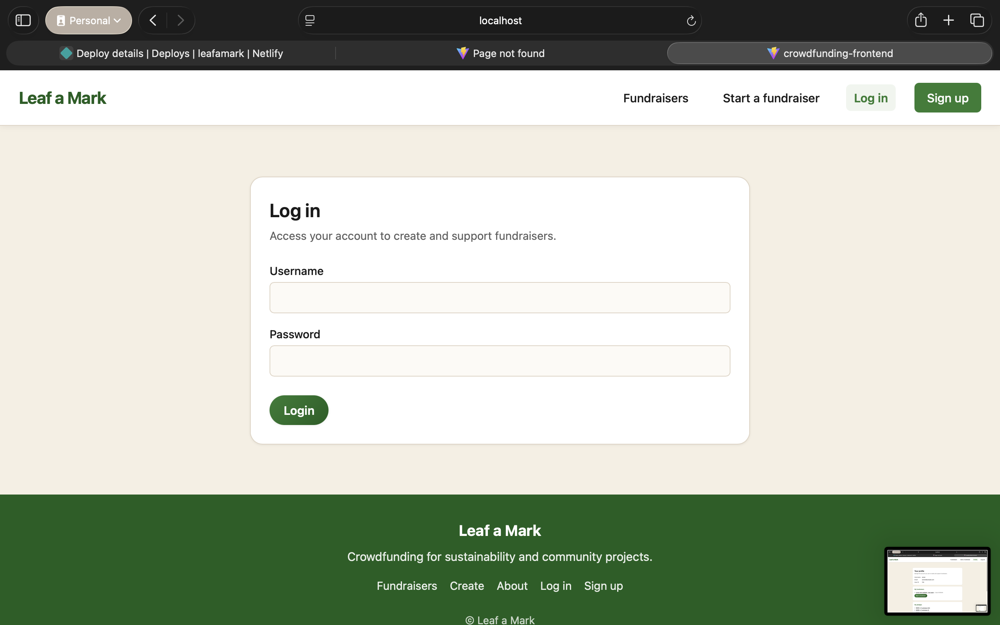
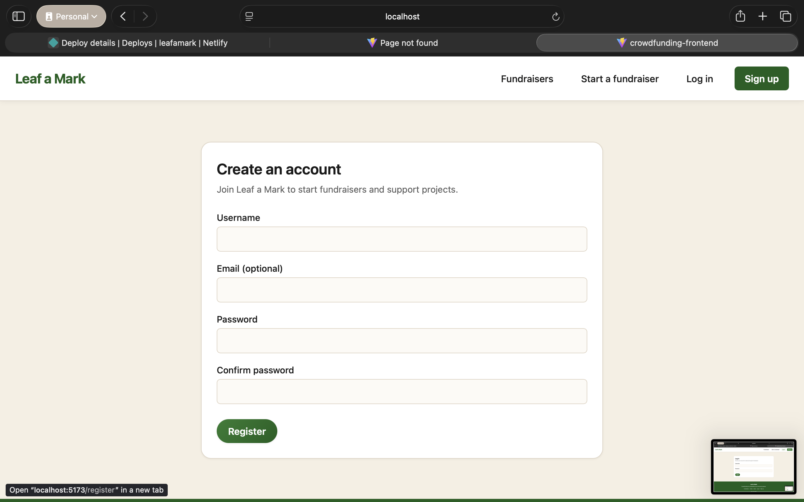

# Leaf a Mark — Crowdfunding Frontend

A React frontend for **Leaf a Mark**, a crowdfunding platform for sustainability and community projects. Users can browse fundraisers, create campaigns, and make pledges. The app talks to a Django REST API (separate repo) for auth, fundraisers, and pledges.

**Target audience:** People who want to support or start environmental and community fundraisers.

---

## Deployed project

- **Frontend:** [front end link]
- **Backend API:** `https://crowdfundingapp-6177aeba64e5.herokuapp.com` (Heroku)

### Page links (Netlify)

| Page              | Path                  | Link |
| ----------------- | --------------------- | ---- |
| About / Welcome   | `/welcome`            |      |
| Home (Fundraisers) | `/`                   |      |
| Login             | `/login`              |      |
| Register          | `/register`           |      |
| Create fundraiser  | `/create`             |      |
| Profile           | `/profile`            |      |
| Fundraiser detail  | `/fundraiser/:id`    |      |
| Edit fundraiser   | `/fundraiser/:id/edit` |    |
| 404               | (any unknown path)    |      |

---

## Screenshots

| Title                | Screenshot                                        |
| -------------------- | ------------------------------------------------- |
| Homepage             |        |
| Fundraisers          |  |
| Create fundraiser    |  |
| Fundraiser + pledges |            |
| Login                |              |
| Sign Up              |           |

---

## API endpoints (backend)

| Method          | Endpoint             | Description                                                                                           |
| --------------- | -------------------- | ----------------------------------------------------------------------------------------------------- |
| **Auth**        |                      |                                                                                                       |
| POST            | `/api-token-auth/`   | Login. Body: `{ "username", "password" }`. Returns `{ "token" }`.                                     |
| **Users**       |                      |                                                                                                       |
| POST            | `/users/`            | Register. Body: `{ "username", "password", "email?" }`.                                               |
| GET             | `/users/me/`         | Current user (requires `Authorization: Token <token>`). Returns `{ id, username, email, ... }`.       |
| GET             | `/users/<id>/`       | User detail by id.                                                                                    |
| **Fundraisers** |                      |                                                                                                       |
| GET             | `/fundraisers/`      | List all fundraisers.                                                                                 |
| POST            | `/fundraisers/`      | Create fundraiser (auth). Body: `{ title, description, image, goal, is_open }`.                       |
| GET             | `/fundraisers/<id>/` | Single fundraiser with nested pledges.                                                                |
| PUT             | `/fundraisers/<id>/` | Update fundraiser (owner only).                                                                       |
| DELETE          | `/fundraisers/<id>/` | Delete fundraiser (owner only).                                                                       |
| **Pledges**     |                      |                                                                                                       |
| GET             | `/pledges/`          | List pledges.                                                                                         |
| POST            | `/pledges/`          | Create pledge (auth). Body: `{ fundraiser, amount, comment?, anonymous? }`. Supporter set from token. |
| GET             | `/pledges/<id>/`     | Single pledge.                                                                                        |
| PUT             | `/pledges/<id>/`     | Update pledge (supporter only). Body: `{ comment?, anonymous? }`.                                     |
